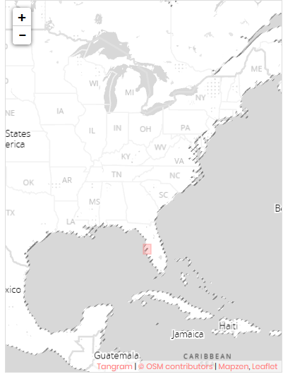

# OpenStreetMap Data Case Study

### Map Area
Tampa, FL, United States

- https://mapzen.com/data/metro-extracts/metro/tampa_florida/

I chose this area, because I am unfamiliar with it, and wanted to see what the data for this area looked like.

## Data Audit
### Unique Tags
Use `mapparser.py` to count the unique tags: 
- `bounds`: 1
- `member`: 31857
- `nd`: 1957582
- `node`: 1655566
- `osm`: 1
- `relation`: 1252
- `tag`: 1131585
- `way`: 182866

### Patterns in the Tags
Use `tags.py` to find these patterns in the tags:
- `lower`: 575997. These are valid tags that only have lowercase letters.
- `lower_colon`: 520908. These are tags with a colon, that are valid otherwise.
- `other`: 34675. These are tags that are not in any of the other categories.
- `problemchars`: 5. These are tags that have problematic characters.

## Problems Encountered in the Map
Use `audit.py` to check and clean for inconsistencies in city, street, and zip codes.

### City name inconsistencies
- Capitalization:
  - `spring hill -> Spring Hill`
  - `SPRING HILL -> Spring Hill`
  - `port richey -> Port Richey`
  - `lutz -> Lutz`
  - `tampa -> Tampa`
- Spelling
  - `Clearwarer Beach -> Clearwater Beach`
  - `St Petersbug -> St. Petersburg`
  - `Zephyhills -> Zephyrhills`
  - `Miakka -> Old Myakka`
- Punctuation
  - `St. Petersburg, FL -> St. Petersburg`
  - `St Pete Beach -> St. Pete Beach`
  - `Saint Petersburg -> St. Petersburg`
  - `Land O Lakes, FL -> Land O' Lakes`
  - `Land O Lakes -> Land O' Lakes`
  - `Palm Harbor, Fl. -> Palm Harbor`
  - `'Tampa  '-> Tampa`
  - `'Seminole  '-> Seminole`
  
### Street name inconsistencies
Some streets are listed with more information than the street address. For example:
- `8492 Manatee Bay Dr Tampa, FL 33635`
- `6010 US-301, Ellenton, FL 34222, Vereinigte Staaten`

To fix these I search all street names for commas, and remove everything after and including the comma.

Some streets have a `#` symbol in their name, for example:
- `Starkey Rd #G`
- `E Fletcher Ave #131`

To fix these, I search all street names for the # symbol, and remove everything after and following the #.

Some streets have abbreviated directions. For example:
- `E -> East`
- `NW -> Northwest`

Additionally, sometimes the direction is listed at the end of the street, rather than at the beginning. For example:
- `37th Ave Northeast`
- `77th Drive West`
- `San Martin Blvd NE`

To fix these, I search all street names for directions, and if there is a direction at the end of the street name I move
it to the front, and I also convert all abbreviated directions to the full direction.

Some street names have `Suite` in the name. For example:
- `66th Street North Suite 135`
- `W Cypress St Suite`

To fix these, I search all street names for `Suite`, and remove everything after and including the `Suite`.

Finally, there are some street types that are not in the expected street names list. These include:
- `Passage`
- `Cutoff`
- `Bridge`
- `Crossing`
- `Lane`
- `Way`
- `Run`
- `Loop`
- `Plaza`
- `Causeway`
- `Terrace`
- `Highway`
- `Bayway`
- `Circle`
- `Trail`
- `Parkway`
- `Commons`

After these fixes, there are still a few inconsistent street names. These are streets 
that are mostly US Highways, such as
- `State Road 52`
- `SR 52`
- `FL 52`
- `U.S. 19`
- `US-301`
### State inconsistencies
Use `audit.py` to clean state names:
The majority of the data have `FL` as the state in `addr:state`. Otherwise, 
the state is listed as:
  - `Florida`: 24
  - `GA`: 3
  - `Fl`: 3
  - `fl`: 16
  - `florida`: 1
  - `f`: 1
  - `FLq`: 1

### Zip code inconsistencies
  - There are a few inconsistent zip codes, all of which have a length longer than 5. For example:
    - 33548:33556
    - 34669; 34667; 34667
    
## Data Overview
### File sizes
- tampa_florida.osm: 355 MB
- nodes_csv: 131 MB
- nodes_tags.csv: 6.5 MB
- ways.csv: 11 MB
- ways_nodes.csv: 44 MB
- ways_tags.csv: 32 MB
- tampa.db: 204 MB

### Number of nodes
1655566

### Number of ways
182866

### Number of unique users
1448

### Top 10 contributing users
- `coleman`: 258302
- `woodpeck_fixbot`: 235013
- `grouper`: 187215
- `EdHillsman`: 106677
- `NE2`: 72924
- `David Hey`: 60918
- `LnxNoob`: 58364
- `KalininOV`: 48825
- `westampa`: 42145
- `bot-mode`: 37656

### Number of users contributing once
330

### Top 10 amenities
- `restaurant`: 852
- `place_of_worship`: 771
- `school`: 553
- `fast_food`: 396
- `bicycle_parking`: 353
- `bench`: 279
- `fuel`: 235
- `fountain`: 201
- `bank`: 170
- `toilets`: 148

### Top 5 places of worship
- `christian`: 724
- `jewish`: 4
- `bahai`: 3
- `buddhist`: 3
- `unitarian_universalist`: 3

### Top 5 cuisines
- `american`: 93
- `pizza`: 70
- `mexican`: 41
- `italian`: 28
- `seafood`: 25

### Top 10 restaurants
- `Tijuana Flats`: 8
- `Applebee's`: 6
- `Bob Evans`: 6
- `Denny's`: 6
- `IHOP`: 6
- `Outback Steakhouse`: 6
- `Panera Bread`: 6
- `Chili's`: 5
- `Golden Corral`: 5
- `Pizza Hut`: 5

## Other Ideas
### Further fix the errors encountered in the street names
The street names that are now considered inconsistent are mostly due to US Highway names 
that have numbers. Therefore, streets that are US Highways should be taken into account when deciding
whether or not a street name is consistent.
#### Benefits
- The dataset is further cleaned
#### Anticipated Issues
- Need to make sure that a street that has the format of a highway name (ends in a number) is actually
a highway, and is not a mistake/typo in the street name.

### Validate zip codes
A few states were listed as `GA`. The addresses that had these listed should be verified with external data to see 
if GA is a typo and the address is indeed in FL, or if the address is in GA and is included in the dataset by mistake.
The zip code fields that have multiple zip codes listed with semicolons also need to be validated. The
data can be validated with external data sources, such as Google Maps.
#### Benefits
- Improvement in accuracy for data queries.
#### Anticipated Issues
- The external database could have incorrect info.
- The external database could be missing the needed information.
- Need users to perform the cleaning.

### Check consistency of other data fields
The consistency of other fields, like phone numbers, also needs to be checked. As with the zip codes,
this can be done by cross-referencing an external data source, and has the same benefits and anticipated
issues.

### Ensure new data is consistent
As this analysis has shown, this dataset is not without errors. Instead of cleaning the dataset after
data has been entered, I think a better way would be to have a more structured way for users to input
data. For example, the user could only select a zip code from zip codes that were validated to be in the area.
#### Benefits
- Less cleaning of data set needed
#### Anticipated Issues
- Need users who are dedicated to implementing the solution, could implement gamification to encourage users
- Initially it would require a lot of time to implement and validate the structured input form

### Add more data for restuarant delivery
From querying the dataset, there are 852 restaurants, of which 91 have information on delivery.
72 have no delivery and 19 do provide delivery. I think that people using the database
would be interested in whether or not a restaurant provides delivery, so the database
could be improved by adding delivery information for more restaurants.
#### Benefits
- Enhanced user experience
#### Anticipated Issues
- Need people to find delivery information
- Requires time to implement
- Need to find external data source, perhaps Yelp data

## Files
All of the analysis is done with the `osm.ipynb` file. The cells were exported in python scripts as:
- `audit.py`: audit street names, city names, and zip codes
- `data.py`: from OSM file, create CSV file
- `database.py`: from CSV file, create SQL database
- `mapparser.py`: count unique tags
- `query.py`: SQL queries used
- `sample.py`: extract 25 MB sample of the OSM file
- `users.py`: get contributing users
- `tags.py`: count patterns in the tags

## References
- https://gist.github.com/carlward/54ec1c91b62a5f911c42#file-sample_project-md
